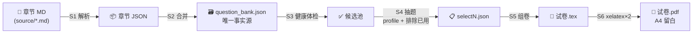

<div align="center">

# 📐 Math Exam Paper Builder（数学组卷）

**从「章节 Markdown 题库」到「A4 留白试卷 PDF」的完整组卷流水线**

[](https://github.com/zxyxck/math-exam-paper-builder/actions/workflows/ci.yml)
[](https://www.python.org/)
[](https://tug.org/texlive/)
[](LICENSE)
[]()

**零依赖**（Python 标准库 + TeX Live）· **跨 Agent 平台 / 跨 AI 可移植** · 卷与卷不重复 · 固定种子可复现

</div>

---

## ✨ 特性

| | |
|---|---|
| 🧩 **标准流水线** | 章节 MD → JSON 题库 → 健康体检 → 按考纲抽题 → LaTeX 组卷 → A4 留白 PDF |
| 🩺 **健康体检** | 自动剔除 LaTeX 语法坏题（cases/pmatrix 不配对、`$` 不配对、公式外裸 `&`…） |
| 🎯 **考纲 profile** | 内置 `数二标准`（22 题/150 分）、`数二真题`（高数 80% + 线代 21.3%）、`高数全`（高数专项）、`数二轮换`（线代 7~12 章跨卷轮换 + 题型配额灵活），可自行追加 |
| 🔀 **跨卷不重复** | `--exclude selectN.json` 自动避开已用题 |
| 🎲 **可复现** | 固定 `--seed` 同参同卷 |
| 📝 **留白版式** | 题目无答案、解答题留白手写区、填空题自动转真横线 |
| 🏷 **题号索引** | 每题的出处 `（高数·第一章·综合·选择3）` 灰字标注，方便对答案 |
| 🚀 **CI 自检** | GitHub Actions 全链路回归（解析→组卷→xelatex 编译 PDF） |

## 🧭 核心链路



- **一次性**：S1/S2 题库建设（MD → JSON）
- **每次组卷**：S3 体检 → S4 抽题 → S5 组卷 → S6 编译
- 可选：S7 导出人读题库 `bank_md/`（每章带题号索引）

## 🚀 快速开始（用自带样例）

仓库自带 `sample/` 样例题库（自造题目，可直接跑通全流程）：

```bash
# 1. 解析样例（高数篇第1章 + 线代篇第7章）
mkdir -p bank
python3 scripts/parse_question_bank.py "sample/高数篇_第一章.md" --book 高数篇 -o bank/ch1.json
python3 scripts/parse_question_bank.py "sample/线代篇_第七章.md" --book 线代篇 -o bank/ch7.json

# 2. 合并 → 健康体检（期望 0 坏题）
python3 scripts/merge_banks.py bank/ -o question_bank.json
python3 scripts/bank_health.py question_bank.json

# 3. 抽题（固定种子可复现）
python3 scripts/pick_from_bank.py question_bank.json --seed 42 --no 1 -o select1.json

# 3.5 批量出 N 套（推荐：自动排除历史卷，跨卷零重复）
python3 scripts/batch_papers.py --papers 3 --profile 数二轮换 --mix 基础题:4

# 4. 组卷 + 编译 PDF（需安装 TeX Live，见下）
python3 scripts/build_exam_tex.py --select select1.json --bank question_bank.json -o "exams/数二模拟卷(一).tex"
```

> 没有 xelatex 时用 `--no-pdf` 只生成 `.tex` 源文件。

## 📥 使用自己的题库

`source/` 下放章节 Markdown（格式约定见 [README-SKILL.md](README-SKILL.md) §3.2）：

```markdown
### 一、基础题                      # 或 二、综合题 / 三、拓展题
#### （一）选择题                   # 或 （二）填空题 / （三）解答题
1.  题干……$公式$……
    A. 选项A    B. 选项B    C. 选项C    D. 选项D   # 可同行或分行
2.  证明：……
    (I) 第一问……                   # (I)(II)(III) 或 ①②③ 为子问
```

然后循环执行上面的 S1~S4 即可。更多细节（含 12 章批量处理、跨卷排除、考纲配置、故障排查）见 **[README-SKILL.md](README-SKILL.md)**。

## 📦 环境依赖

| 组件 | 版本 | 用途 | 必需 |
|---|---|---|---|
| Python | ≥ 3.9（标准库即可） | 全部脚本 | ✅ |
| TeX Live（xelatex + ctex + fandol） | 任意发行版 | 编译 PDF | 出 PDF 时 |
| pip 第三方包 | 无 | — | ❌ 不需要 |

```bash
# Ubuntu / Debian
sudo apt-get install -y python3 texlive-xetex texlive-lang-chinese
# macOS: brew install python3 && brew install --cask mactex-no-gui
# Windows: python.org 安装 Python + tug.org 安装 TeX Live（勾选 collection-langchinese）
```

## 📂 仓库结构

```
├── scripts/                 # 组卷流水线（8 个脚本，零第三方依赖）
│   ├── parse_question_bank.py   # S1 章节 MD → JSON
│   ├── merge_banks.py           # S2 合并题库
│   ├── bank_health.py           # S3 LaTeX 健康体检
│   ├── pick_from_bank.py        # S4 按考纲抽题（PROFILES 在此配置）
│   ├── batch_papers.py          # 一键批量组卷（自动排除已用题）
│   ├── build_exam_tex.py        # S5/S6 组卷 + xelatex 编译
│   ├── export_bank.py           # S7 人读题库导出
│   ├── _verify_scan.py          # S8 完整性扫描
│   └── pdf_bank_parser.py       # 可选：解析做题本 PDF 补选项
├── sample/                  # 样例题库（自造题目，CI 回归用）
├── .github/workflows/ci.yml # GitHub Actions 全链路自检
├── README-SKILL.md          # 完整技能文档（格式约定/工作流/排障）
└── MIGRATE.md               # 跨机器/跨 Agent 移植指南
```

## ✅ CI 自检

每次 push 自动跑：脚本语法检查 → 样例解析 → 合并 → 体检（0 坏题断言）→ 完整性扫描 → 抽题 → 组卷 → **xelatex 编译 PDF**，并把试卷作为 artifact 上传，可下载查看。

## 📜 许可

MIT License —— 详见 [LICENSE](LICENSE)。

> ⚠️ **本仓库不含任何题库内容**（`question_bank.json` / `source/` 已被 `.gitignore` 排除）。
> 若题库来自商业教辅（如《880题》），请勿公开发布题目文本；建议使用自有题目或私有仓库。
